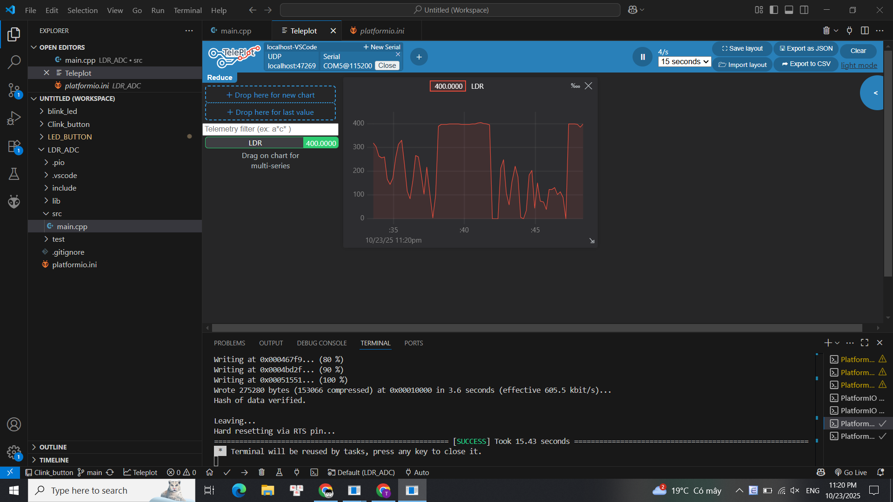

# Dự án ESP32 đọc cảm biến LDR với Teleplot

Đây là một dự án đơn giản sử dụng PlatformIO và ESP32 để đọc giá trị analog từ một cảm biến quang trở (LDR) và hiển thị dữ liệu đó theo thời gian thực bằng công cụ Teleplot trong VS Code.

## Tính năng

* Đọc giá trị điện áp từ cầu chia áp LDR qua chân ADC (`GPIO 34`).
* In giá trị ADC (0-4095) ra cổng Serial theo định dạng tương thích với Teleplot.
* Cho phép theo dõi cường độ ánh sáng (tương đối) bằng đồ thị trực quan.

## Hardware (Phần cứng)

Dự án này sử dụng một mạch cầu chia áp đơn giản để ESP32 có thể đọc được sự thay đổi điện trở của LDR.

* **Linh kiện:**
    * 1 x ESP32 Dev Module
    * 1 x Cảm biến LDR (Quang trở)
    * 1 x Điện trở 10kΩ
* **Sơ đồ nối dây:**
    * `3.3V` -> `Điện trở 10kΩ`
    * `(Điểm giữa 10kΩ và LDR)` -> `GPIO 34` (Chân ADC của ESP32)
    * `LDR` -> `GND`

## Cài đặt & Sử dụng

### 1. Yêu cầu phần mềm

* [Visual Studio Code](https://code.visualstudio.com/)
* [PlatformIO IDE Extension](https://platformio.org/platformio-ide)
* [Teleplot Extension](https://marketplace.visualstudio.com/items?itemName=alexnesnes.teleplot)

### 2. Hướng dẫn chạy

1.  Mở thư mục dự án này bằng VS Code (PlatformIO sẽ tự động nhận diện).
2.  Biên dịch (Compile) và Nạp (Upload) code vào ESP32 bằng các nút trên thanh công cụ PlatformIO.
3.  **Quan trọng:** Sau khi nạp xong, hãy **ĐÓNG** tất cả các cửa sổ Serial Monitor (biểu tượng 🔌) nếu chúng đang mở.
4.  Mở Bảng lệnh (Command Palette) của VS Code (nhấn `Ctrl+Shift+P`).
5.  Gõ và chọn `Teleplot: Open Serial`.
6.  Chọn cổng COM mà ESP32 đang kết nối.
7.  Chọn tốc độ Baud là `115200` (phải khớp với `monitor_speed` và `Serial.begin()`).
8.  Một tab đồ thị sẽ mở ra. Hãy thử che LDR hoặc chiếu đèn vào nó để thấy đồ thị "light_level" thay đổi.

